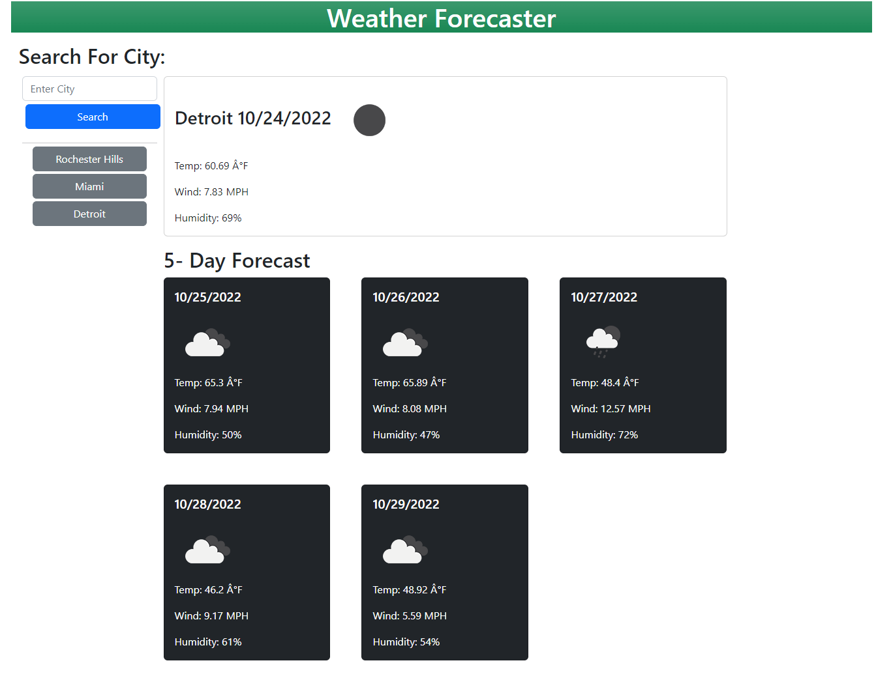

# Weather Forecaster

## Description

A web-based weather forecast generator that uses api to call data based on city and geolocation.

## Table of Contents

1. [Installation](#Installation)
2. [Usage](#Usage)
3. [License](#License)
4. [Questions](#Questions)

### Installation

Navigate to the provided URL to access.

### Usage

Provides real-time weather information on the go.

### License

### Questions

**Github Information**

Username: Archer261

Profile: <https://github.com/Archer261>

If you have any additional questions, I can be reached via email at <viewtiful.kja@gmail.com>
